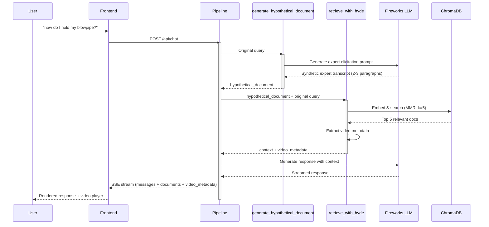

# HyDE Pipeline Architecture

## High-Level Flow



## Node Details

### Node 1: `generate_hypothetical_document`

**Input State**:
```python
{
    "messages": [HumanMessage("how do I hold my blowpipe?")]
}
```

**Processing**:
1. Extract original query from `messages[-1]`
2. Create French prompt asking for expert-style elicitation
3. Invoke LLM to generate 2-3 paragraphs of technical, first-person explanation
4. Log preview of generated document

**Output State**:
```python
{
    "messages": [HumanMessage("how do I hold my blowpipe?")],
    "hypothetical_document": "Je tiens le chalumeau avec ma main droite environ 15 cm de l'extrémité, le pouce sur le dessus pour le contrôle. Ma main gauche soutient par en dessous au point d'équilibre. Quand je tourne, je sens le poids se déplacer - cela me dit que la paraison est centrée..."
}
```

### Node 2: `retrieve_with_hyde`

**Input State**:
```python
{
    "messages": [HumanMessage("how do I hold my blowpipe?")],
    "hypothetical_document": "Je tiens le chalumeau..."
}
```

**Processing**:
1. Check if documents exist in vector store
2. Use `hypothetical_document` as search query (fallback to original if missing)
3. Perform MMR similarity search with k=5
4. Extract video metadata from top document if available
5. Log retrieval stats

**Output State**:
```python
{
    "messages": [HumanMessage("how do I hold my blowpipe?")],
    "hypothetical_document": "Je tiens le chalumeau...",
    "context": [
        Document(page_content="transcript_text", metadata={...}),
        Document(...),  # 5 total documents
    ],
    "video_metadata": {
        "video_id": "a3f9d...",
        "filename": "glassblowing_demo.mp4",
        "start_time": 45.2,
        "end_time": 78.5,
        "video_url": "/api/video/stream/a3f9d...",
        ...
    }
}
```

### Node 3: `generate`

**Input State**: Full state from retrieval

**Processing**:
1. Format context documents into text
2. Apply prompt template with history, context, and query
3. Invoke LLM with streaming
4. Return generated messages

**Output State**:
```python
{
    "messages": [
        HumanMessage("how do I hold my blowpipe?"),
        AIMessage("Pour tenir correctement le chalumeau...")
    ],
    "context": [...],
    "video_metadata": {...}
}
```

## Comparison: Old vs New

### Old Pipeline (3 Nodes)

```
┌─────────────┐      ┌───────────────┐      ┌────────────────┐      ┌──────────┐
│   retrieve  │─────▶│ enhance_query │─────▶│ retrieve_final │─────▶│ generate │
│   (k=15)    │      │   (LLM call)  │      │    (k=15)      │      │          │
└─────────────┘      └───────────────┘      └────────────────┘      └──────────┘
     30 ops                1 LLM                  30 ops              1 LLM
```

**Total**: 60 embedding operations + 2 LLM calls

### New HyDE Pipeline (2 Nodes)

```
┌─────────────────────────────┐      ┌───────────────────┐      ┌──────────┐
│ generate_hypothetical_doc   │─────▶│ retrieve_with_hyde│─────▶│ generate │
│        (LLM call)           │      │       (k=5)       │      │          │
└─────────────────────────────┘      └───────────────────┘      └──────────┘
          1 LLM                              5 ops                  1 LLM
```

**Total**: 5 embedding operations + 2 LLM calls

**Savings**: 92% reduction in embedding operations (55 ops saved)

## Why HyDE Works

### The Semantic Gap Problem

**Novice Query** (natural language):
> "how do I hold my blowpipe?"

**Expert Transcript** (technical, first-person):
> "Je place ma main dominante à environ 15 centimètres de l'extrémité du chalumeau, avec le pouce positionné sur la partie supérieure pour assurer un contrôle précis. L'index et le majeur viennent naturellement entourer le tube, créant une prise ferme mais souple..."

**Embedding Distance**: High (poor match) ❌

### HyDE Solution

**Generated Hypothetical Document**:
> "Je tiens le chalumeau avec ma main droite environ 15 cm de l'extrémité, le pouce sur le dessus pour le contrôle. Ma main gauche soutient par en dessous au point d'équilibre. Quand je tourne, je sens le poids se déplacer..."

**Embedding Distance to Expert Transcript**: Low (excellent match) ✅

## Key Benefits

1. **Linguistic Alignment**: HyDE document matches expert transcript style
2. **Single Retrieval**: More efficient than double retrieval
3. **No Bootstrap Problem**: Doesn't depend on initial retrieval quality
4. **Better Context**: Returns 5 docs instead of 1
5. **Faster**: Fewer vector operations = lower latency
6. **Domain Adaptive**: Prompt customizable per domain

## Testing Checklist

- [ ] Test with vague novice queries ("how do I...", "what's the technique...")
- [ ] Verify HyDE document generation quality (French language, technical terms)
- [ ] Confirm retrieval returns relevant expert transcripts
- [ ] Measure latency improvement vs old pipeline
- [ ] Check video metadata extraction works correctly
- [ ] Test fallback when HyDE generation fails
- [ ] Validate with pure generation mode (no documents)
- [ ] Test conversation history handling

## Configuration

No configuration changes needed. The pipeline automatically:
- Uses HyDE when documents exist
- Falls back to original query if HyDE fails
- Handles pure generation mode when no documents

## Monitoring

Key logs to watch:
```
INFO: HyDE generated document length: 547 chars
INFO: HyDE preview: Je tiens le chalumeau avec ma main droite...
INFO: Using HyDE-generated document for retrieval
INFO: Retrieved 5 documents using HyDE
INFO: HyDE retrieval: 5 docs, video_metadata: True
```

## Rollback

To revert to old pipeline:
```python
# In pipeline.py, change:
functions=["retrieve", "enhance_query", "retrieve_final", "generate"]

# Update generate_response() node handlers back to:
# - retrieve_runnable
# - enhance_query_runnable  
# - retrieve_final_runnable
```
